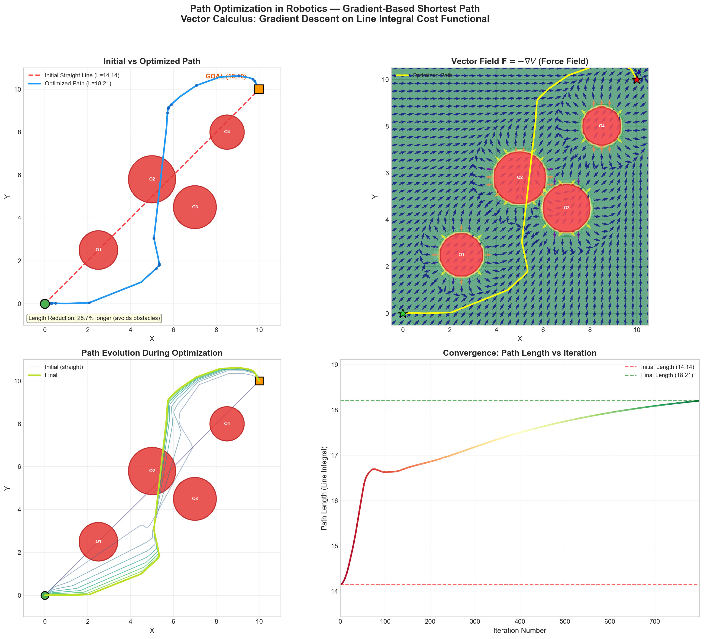

# Path Optimization in Robotics — Vector Calculus Project

> **Topic 6**: Path Optimization in Robotics  
> **Course**: Vector Calculus (4th Semester Engineering)

A gradient-based path optimization system that simulates a robot navigating from **(0, 0)** to **(10, 10)** through an obstacle-filled environment, using vector calculus concepts to minimize travel distance.



---

## 1. Problem Statement

Students will simulate a robot moving from one point to another using the shortest path. Gradient-based optimization will be used to minimize travel distance. **Focus**: Path planning, Cost minimization, Visualization of movement.

The chosen real-world problem is **Path Optimization in Robotics for shortest-path navigation in an environment with obstacles** — applicable to warehouse automation, disaster-zone exploration, and autonomous vehicle navigation.

---

## 2. Mathematical Model

### 2.1 Path Representation (Parametric Curve)

The robot's path is represented as a **vector-valued function** (parametric curve):

$$\mathbf{r}(t) = (x(t),\ y(t)), \quad t \in [0, 1]$$

Discretized into $N+2$ waypoints: $P_0 = \text{start},\ P_1, \ldots, P_N,\ P_{N+1} = \text{goal}$

The initial path is a straight line:

$$\mathbf{r}(t) = (1-t) \cdot \mathbf{start} + t \cdot \mathbf{goal}$$

### 2.2 Cost Functional (Line Integral)

The path length is defined as the **line integral of arc length**:

$$L = \int_C \|\mathrm{d}\mathbf{r}\| = \int_0^1 \sqrt{\left(\frac{dx}{dt}\right)^2 + \left(\frac{dy}{dt}\right)^2}\, dt$$

**Discrete approximation**:

$$L \approx \sum_{i=0}^{N} \|P_{i+1} - P_i\|$$

### 2.3 Scalar Potential Field

A potential field $V(x,y)$ is constructed to encode the environment:

**Attractive potential** (pulls toward goal):

$$V_{\text{att}}(x,y) = \frac{1}{2} k_{\text{att}} \|(x,y) - \mathbf{goal}\|^2$$

**Repulsive potential** (pushes away from obstacles):

$$V_{\text{rep}}(x,y) = \begin{cases} \frac{1}{2} k_{\text{rep}} \left(\frac{1}{\rho} - \frac{1}{\rho_0}\right)^2 & \text{if } \rho \leq \rho_0 \\ 0 & \text{if } \rho > \rho_0 \end{cases}$$

where $\rho$ = distance to nearest obstacle surface, $\rho_0$ = influence radius.

The **negative gradient** gives the force field:

$$\mathbf{F}(x,y) = -\nabla V(x,y)$$

### 2.4 Gradient Descent Optimization

Each internal waypoint $P_k$ is updated iteratively:

$$P_k^{\text{new}} = P_k - \eta \cdot \frac{\partial \text{Cost}}{\partial P_k}$$

where the total gradient combines:

1. **Path length gradient**: $\frac{\partial L}{\partial P_k} = \frac{P_k - P_{k-1}}{\|P_k - P_{k-1}\|} - \frac{P_{k+1} - P_k}{\|P_{k+1} - P_k\|}$

2. **Obstacle repulsion gradient**: $\frac{\partial V_{\text{rep}}}{\partial P_k} = k_{\text{rep}} \left(\frac{1}{\rho} - \frac{1}{\rho_0}\right) \frac{1}{\rho^2} \cdot \frac{-(P_k - c)}{\|P_k - c\|}$

3. **Smoothness gradient** (curvature penalty): $\frac{\partial S}{\partial P_k} \propto -(P_{k+1} - 2P_k + P_{k-1})$

---

## 3. Algorithm / Approach Used

**Gradient-Based Path Optimization with Artificial Potential Fields**

1. **Initialize** path as straight line from (0,0) to (10,10) — 42 waypoints
2. **Compute** analytical gradient of total cost for each internal waypoint
3. **Update** waypoints via gradient descent: $P_k \leftarrow P_k - \eta \cdot \nabla \text{Cost}_k$
4. **Repeat** until convergence or max iterations reached
5. **Evaluate** final path length via line integral

Key design choices:
- Analytical gradients (not numerical) for efficiency
- Gradient clipping prevents instability near obstacles
- Adaptive learning rate with decay schedule
- Convergence detection via cost plateau

---

## 4. Code Implementation

The complete implementation is in [`robot_path_optimization.py`](robot_path_optimization.py).

**Modular structure:**

| Function | Purpose | Vector Calculus Concept |
|----------|---------|----------------------|
| `attractive_potential()` | Quadratic potential toward goal | Scalar field |
| `repulsive_potential()` | Obstacle barrier potential | Scalar field with localized support |
| `compute_potential_gradient_field()` | Force field $\mathbf{F} = -\nabla V$ | **Gradient** of scalar field |
| `create_straight_path()` | Initial parametric path $\mathbf{r}(t)$ | **Parametric curve** |
| `compute_path_length()` | Arc length $L = \int_C \|\mathrm{d}\mathbf{r}\|$ | **Line integral** |
| `compute_total_gradient()` | $\partial\text{Cost}/\partial P_k$ | **Gradient** for optimization |
| `optimize_path()` | Gradient descent loop | Gradient descent on functionals |
| `plot_all_results()` | 4-panel visualization | Field visualization |

---

## 5. Graphs / Visualizations

The script generates a **4-panel figure** (`path_optimization_results.png`):

| Panel | Title | Description |
|-------|-------|-------------|
| Top-Left | **Initial vs Optimized Path** | Shows the straight-line (colliding) path in red dashed and the optimized (collision-free) path in blue. Start = green circle, Goal = orange square. |
| Top-Right | **Vector Field F = −∇V** | Quiver plot showing the gradient force field arrows, colored by magnitude. Yellow overlay shows the optimized path navigating through the field. |
| Bottom-Left | **Path Evolution** | Multiple intermediate paths showing how waypoints evolve during gradient descent, from initial straight line (light) to final optimized path (bright). |
| Bottom-Right | **Convergence Graph** | Path length (line integral value) vs iteration number. Shows the cost increasing from 14.14 (colliding) to ~18.2 (collision-free) as obstacles push the path outward. |

---

## 6. Testing and Results Analysis

| Metric | Value |
|--------|-------|
| Start point | (0, 0) |
| Goal point | (10, 10) |
| Obstacles | 4 circular |
| Straight-line distance | 14.14 units |
| Initial path length | 14.14 units (**collides** with obstacles) |
| Optimized path length | **18.21 units** (collision-free) |
| Length overhead | +28.7% (cost of obstacle avoidance) |
| Iterations | 800 |
| Computation time | ~1.3 seconds |
| Collision after optimization | **None** ✓ |

**Analysis**: The initial straight-line path has the minimum possible length (14.14 = 10√2) but passes directly through obstacles O1 and O4. After gradient descent optimization, the path bends around all obstacles, increasing length by 28.7% — a necessary trade-off for physical feasibility. The convergence graph shows the cost initially spiking as waypoints are pushed out of obstacles, then stabilizing as the path settles into an optimal collision-free configuration.

---

## 7. Vector Calculus Concepts Applied

### Gradient (∇V)
**Where used:** Two places — (1) computing the force field $\mathbf{F} = -\nabla V$ from the potential, and (2) computing $\partial\text{Cost}/\partial P_k$ for gradient descent optimization.  
**Code:** `compute_potential_gradient_field()` uses `np.gradient()` for numerical differentiation; `compute_total_gradient()` uses analytical derivatives.

### Line Integral (∫_C)
**Where used:** Computing the path length $L = \int_C \|\mathrm{d}\mathbf{r}\| \approx \sum \|P_{i+1} - P_i\|$. This is the primary cost functional being minimized.  
**Code:** `compute_path_length()` implements the discrete line integral.

### Parametric Curves / Vector-Valued Functions
**Where used:** The path representation $\mathbf{r}(t) = (x(t), y(t))$ with $t \in [0,1]$ is a vector-valued function of a scalar parameter.  
**Code:** `create_straight_path()` initializes $\mathbf{r}(t) = (1-t)\cdot\text{start} + t\cdot\text{goal}$.

### Divergence (∇·F)
**Where used:** Computed for the force field to characterize its source/sink structure. Divergence is positive near obstacles (sources — pushes outward) and negative near the goal (sink — attracts inward).  
**Code:** `compute_potential_gradient_field()` computes and returns divergence.

### Multiple Integrals
**Where used:** The potential field $V(x,y)$ is evaluated over the entire 2D workspace domain, effectively performing a discrete double integral. The total potential energy is $\iint V(x,y)\,dA$.  
**Code:** `total_potential()` evaluates $V$ on a 100×100 meshgrid.

---

## 8. Conclusion

This project demonstrates that **vector calculus provides a rigorous and practical mathematical framework** for solving real-world robotics path planning problems. The Artificial Potential Field method, grounded in the concept of scalar fields and their gradients, naturally produces obstacle-avoiding paths when combined with gradient descent optimization on the line integral cost functional.

**Practical applications** include:
- **Warehouse robots** navigating around shelving and personnel
- **Autonomous vehicles** planning routes through urban environments
- **Surgical robots** computing safe trajectories near critical anatomy
- **Drone navigation** through cluttered indoor/outdoor spaces

The key insight is that by formulating path planning as an optimization problem on a well-designed potential field, the robot's trajectory emerges naturally from the mathematics — the gradient points the way, and the line integral measures the cost.

---

## How to Run

```bash
# 1. Clone this repository
git clone https://github.com/YOUR_USERNAME/robot-path-optimization.git
cd robot-path-optimization

# 2. Create a virtual environment (recommended)
python3 -m venv .venv
source .venv/bin/activate

# 3. Install dependencies
pip install -r requirements.txt

# 4. Run the optimization
python3 robot_path_optimization.py
```

**Output:**
- Console output with all metrics
- `path_optimization_results.png` — 4-panel visualization figure
- Mermaid diagram code (copy to [mermaid.live](https://mermaid.live) to render)

---

## Dependencies

- Python 3.10+
- NumPy ≥ 1.24
- Matplotlib ≥ 3.7
- SciPy ≥ 1.10

## License

This project is submitted as academic coursework for Vector Calculus (4th Semester).
